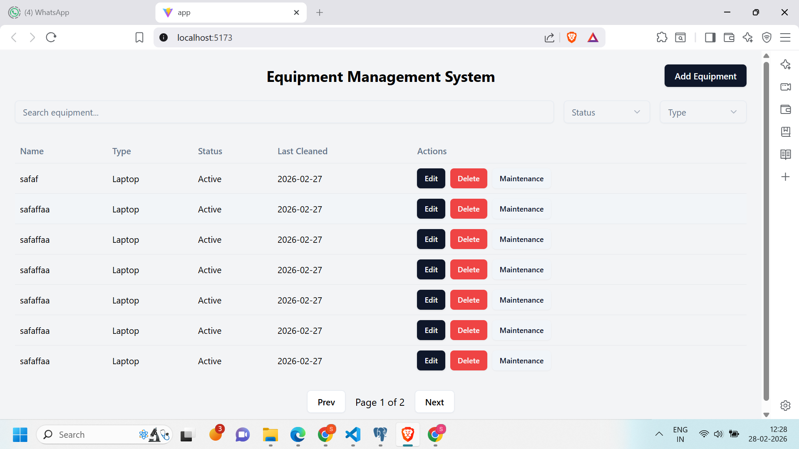
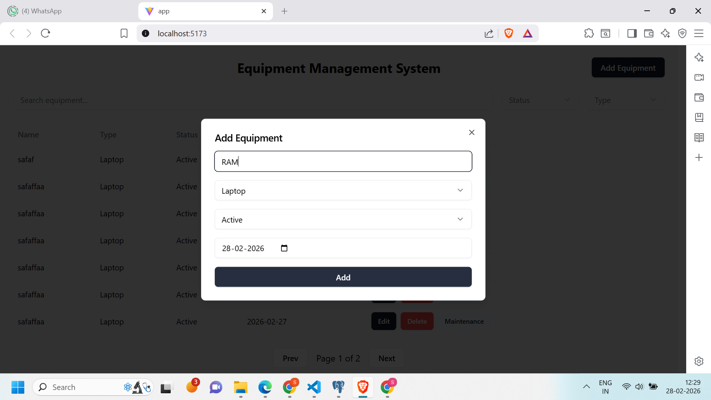
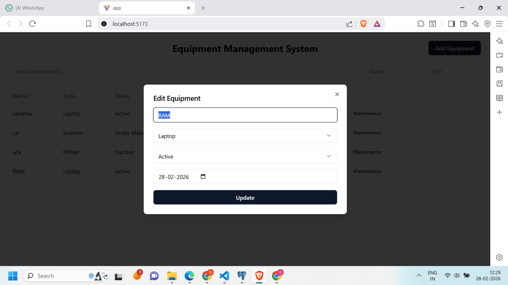

# 🛠 Equipment Management System

A full-stack Equipment Management System built using **React + Spring Boot + PostgreSQL** to manage equipment records, maintenance logs, and status tracking.

---

## 🚀 Tech Stack

### Frontend
- React (Vite)
- Tailwind CSS
- shadcn/ui
- Axios

### Backend
- Spring Boot
- Spring Data JPA
- Hibernate

### Database
- PostgreSQL

---

## ✨ Features

- View all equipment
- Add new equipment
- Edit equipment (same form)
- Delete equipment
- Equipment type dropdown from database
- Maintenance log tracking
- Maintenance history per equipment
- Auto update status after maintenance
- Validation: Cannot mark Active if last cleaned > 30 days
- Search equipment
- Filter by status
- Filter by type
- Pagination

---

### Dashboard


### Add Equipment


### Maintenance Log


### edit 


## 🗄 Database Setup (PostgreSQL)

Create database:

### Tables

```sql
CREATE TABLE equipment_type (
 id SERIAL PRIMARY KEY,
 name VARCHAR(100) UNIQUE NOT NULL
);

CREATE TABLE equipment (
 id SERIAL PRIMARY KEY,
 name VARCHAR(150),
 status VARCHAR(50),
 last_cleaned_date DATE,
 type_id INT REFERENCES equipment_type(id)
);

CREATE TABLE maintenance_log (
 id SERIAL PRIMARY KEY,
 equipment_id INT REFERENCES equipment(id),
 maintenance_date DATE,
 notes TEXT
);
INSERT INTO equipment_type(name)
VALUES ('Laptop'),('Printer'),('Scanner'),('Projector');


//
⚙ Backend Setup

Go to backend folder:

cd backend

Run:

mvnw spring-boot:run

Backend runs on:

http://localhost:8080
 


 //💻 Frontend Setup

Go to frontend:

cd frontend/app
npm install
npm run dev

Frontend runs on:

http://localhost:5173


